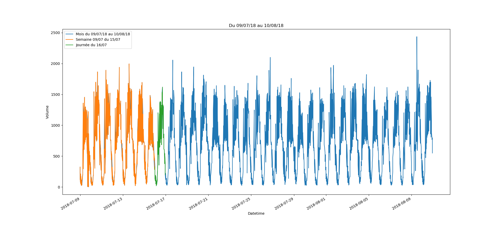
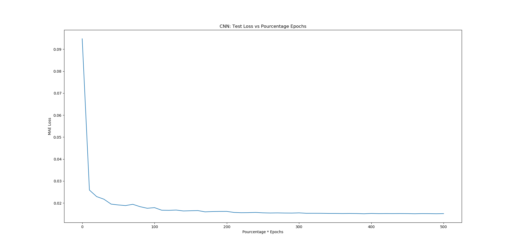
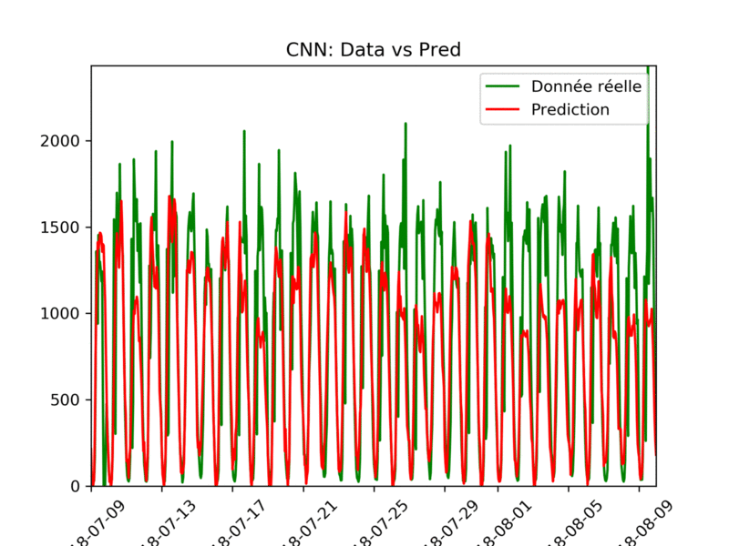
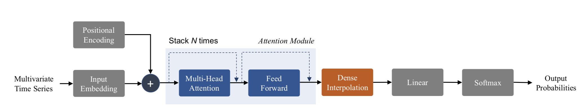

# Report Project Mines ML 2020

Authors: Patrice CHANOL & Corentin MORVAN--CHAUMEIL

## Data Analysis

Nous avons réalisé une très simple analyse des données par analyse de graphe.

Tout d'abord, nous avons décidé de prédire les volumes de voitures pour chaque localisation, chaque direction et ce par heure.

Ici, nous affichons les volumes horaires du 09 Juillet 2018 au 10 Aout 2018 pour une direction.

Nous pouvons remarqué une saisonnalité journalière et hebdomadaire des volumes.

- Chaque jour, il y a quatre parties
  - Croissance du volume de voitures le matin
  - Variations du volume durant la journée en restant élevé
  - Décroissance du volume le soir
  - Volume très faible la nuit
- Chaque semaine, le volume maximum de la journée augmente en début de semaine puis reste élevés durant la semaine et décroit en fin de semaine

## Data Preprocessing

Ainsi, nous avons choisis de garder comme paramètres : 

- Les volumes horaires sur une période de longueur T : fenêtre d'entrée
- Le jour de la semaine sous forme de one-hot-vector

Il pourrait être intéressant d'utiliser d'autres données mais elle ne semble pas plus nécessaire à prédire et n'améliore que très peu les modèles.

## Models

### CNN

Il s'agit d'un CNN simple comprenant 2 couches de convolutions.

La fenêtre d'entrée va passer  dans une première couche pour en sortir 24 nouvelles, puis les 24 vont passer dans une deuxième couche pour en sortir 48.

Ensuite, on aura une couche fully connected avec comme paramètres la sortie de la deuxième convolution, les one-hot vectors des jours de la semaine et on va prédire l'output_window

​																		Evolution des prédictions pendant l'apprentissage

​																		Données vs Prédictions à partir des prédictions

En fonction de la taille de la fenêtre de sorti le modèle sera plus ou moins performant pour prédire ou pour forecast.

En effet, une très petite fenêtre de sortie permet au modèle d'être très précis en prédiction mais très mauvais en forecast. Il aura tendance à très vite rester constant à la même valeur car il a du mal à prédire les changement brusque. A l'inverse, les modèles avec un fenêtre de sortie plus grande seront moins performant pour prédire mais bien plus efficace pour forecast.

### LSTM

Il s'agit d'un modèle LSTM à 1 couche avec 200 hidden states.
SUITE et images à venir.........

## Attention Model

L'un des objectifs de l'analyse de Time Series est de réaliser des prédictions à plusieurs étapes de façon précise.

Ainsi, on s'est inspiré de [[1]](#1) pour réaliser un modèle prenant en compte des couches de multi-head-attention.

 

Ici, le problème est différent, en effet, on ne cherche pas à prédire des classes. Ainsi, nous ne réalisons pas de Convolution pour simuler des embeddings, toutefois, on conserve l'encodage positionnel et on supprime le softmax final.

On s'est inspiré du programme réaliser en [[2]](#2) pour réaliser à notre tour un Transformer.

Il aurait pu être intéressant aussi implémenter un Transformer qui prend en compte les one-hot-vectors des jours de la semaine comme le suggère le modèle de l'article [Temporal Fusion Transformers for Interpretable Multi-horizon Time Series Forecasting](#https://arxiv.org/pdf/1912.09363.pdf "Temporal Fusion Transformers for Interpretable Multi-horizon Time Series Forecasting") pour prendre en compte des "future inputs". On aurait pu aussi implémenter des convolutions causales comme propose [Enhancing the Locality and Breaking the Memory Bottleneck of Transformer on Time Series Forecasting](#https://arxiv.org/pdf/1907.00235.pdf "Enhancing the Locality and Breaking the Memory Bottleneck of Transformer on Time Series Forecasting").

Toutefois, ce modèle simple est déjà performant.

## References

<a id="1">[1]</a> Huan Song, Deepta Rajan, Jayaraman J. Thiagarajan, and Andreas Spanias. Attend anddiagnose: Clinical time series analysis using attention models, 2017.

<a id="1">[2]</a> [Oliver Guhr](https://github.com/oliverguhr), [Transformer Time Series Prediction](https://github.com/oliverguhr/transformer-time-series-prediction "Transformer Time Series Prediction Github ")

