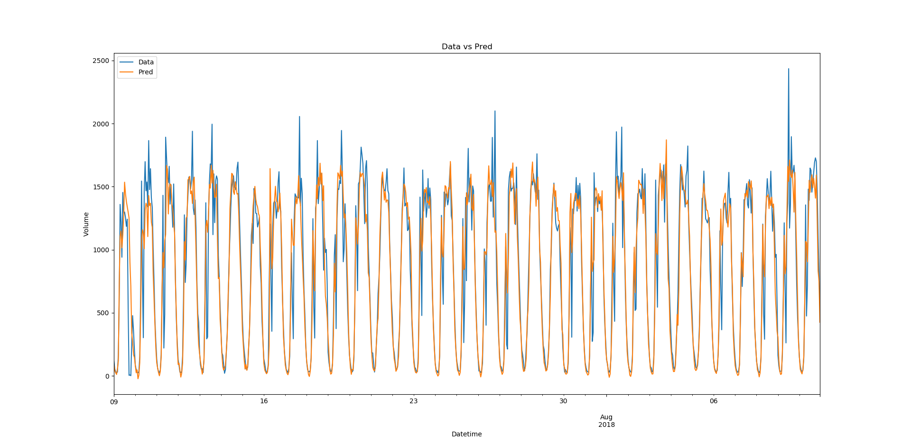
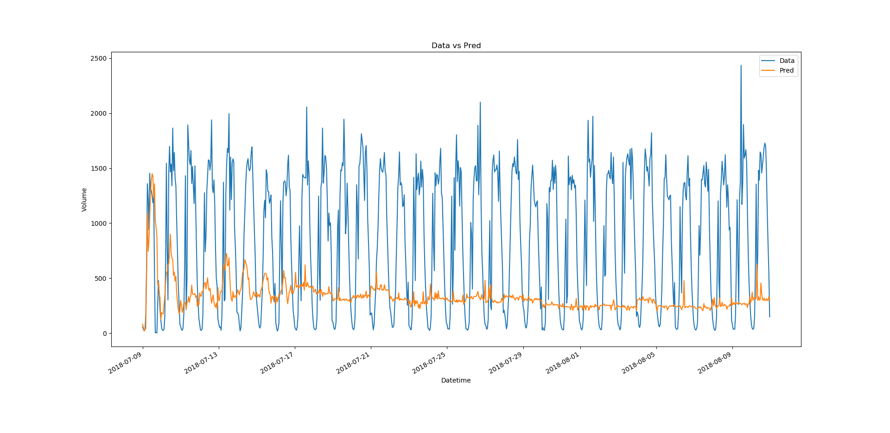

# Report Project Mines ML 2020

Authors: Patrice CHANOL & Corentin MORVAN--CHAUMEIL

## Data Analysis

Nous avons réalisé une très simple analyse des données par analyse de graphe.

Tout d'abord, nous avons décidé de prédire les volumes de voitures pour chaque localisation, chaque direction et ce par heure.

Ici, nous affichons les volumes horaires du 09 Juillet 2018 au 10 Aout 2018 pour une direction.

Nous pouvons remarqué une saisonnalité journalière et hebdomadaire des volumes.

- Chaque jour, il y a quatre parties
  - Croissance du volume de voitures le matin
  - Variations du volume durant la journée en restant élevé
  - Décroissance du volume le soir
  - Volume très faible la nuit
- Chaque semaine, le volume maximum de la journée augmente en début de semaine puis reste élevés durant la semaine et décroit en fin de semaine

## Data Preprocessing

Ainsi, nous avons choisis de garder comme paramètres : 

- Les volumes horaires sur une période de longueur T (entre 1h et 24h)
  - Les T-1 heures avant l'heure à prédire
  - Les T heures, 24h avant l'heure à prédire
  - Les T heures, 7 jours avant l'heure à prédire
- Les localisations normalisées (latitude, longitude)
- Les directions sous forme de one-hot-vector
- Le nom du jour de la semaine sous forme de one-hot-vector
- Le numéro du mois sous forme de one-hot-vector

Il pourrait être intéressant de conserver les volumes sur toute la semaine.

## Models

### CNN

Il s'agit d'un CNN simple comprenant 2 couches de convolutions.

Les 3 séries (de longueur T-1) vont passer dans une première couche pour en sortir 24 nouvelles, puis les 24 vont passer dans une deuxième couche pour en sortir 48.

Ensuite, on aura une couche fully connected avec comme paramètres la sortie de la deuxième convolution, les valeurs à T-24h et T-7jours, les one-hot vectors des mois, jours de la semaine, la longitude et la latitude et on va prédire l'heure suivante

​																		Données vs Prédictions à partir des données

​																		Données vs Prédictions à partir des prédictions

Le modèle est très performant pour prédire à 1 étape, cependant il réagit mal à la prédiction sur plusieurs étapes. En effet, il va rester plus ou moins fidèle aux variations sur les 7 premiers jours (ce qui est normal car en entrée on aura besoin des données des 7 derniers jours) mais deviendra très rapidement linéaire. D'autres modèles de CNN plus simple ou plus complexe, vont globalement aboutir au même résultat mais les plus simples réaliseront la prédiction à plusieurs étapes avec plus de difficulté.

## References

