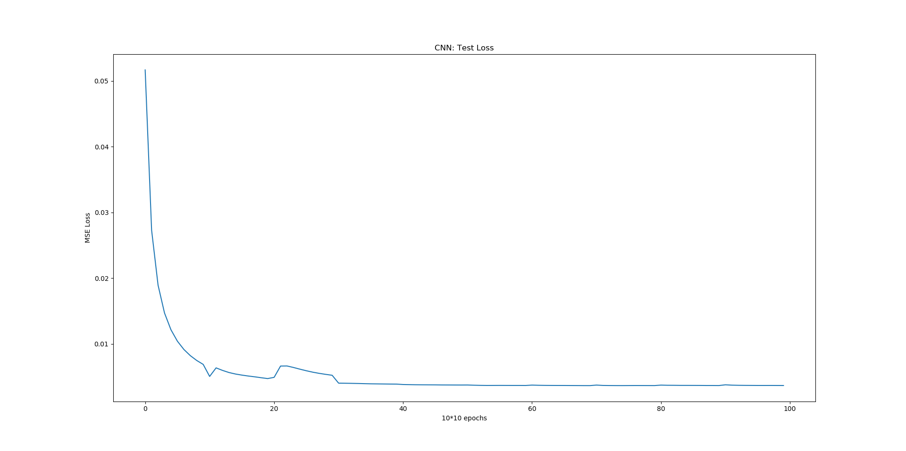
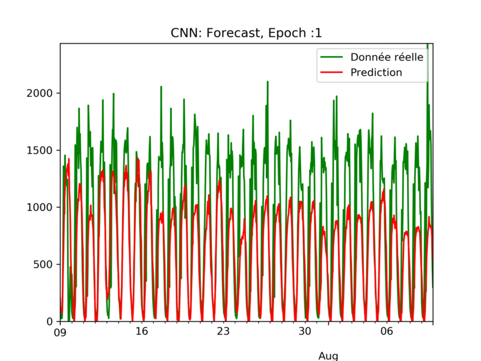
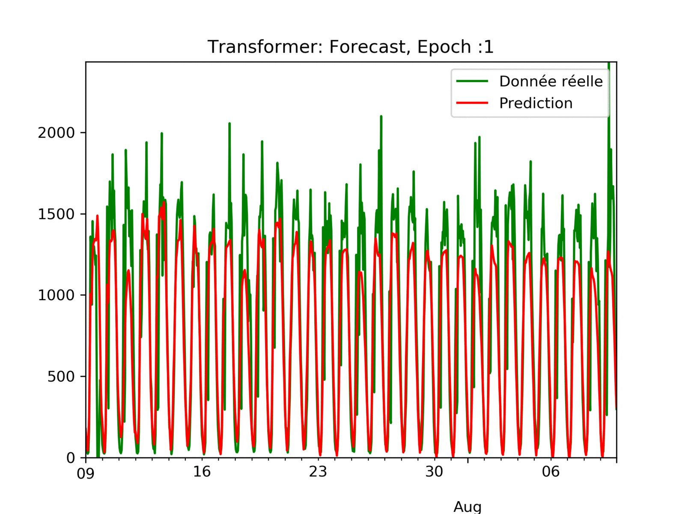

# Report Project Mines ML 2020

Authors: Patrice CHANOL & Corentin MORVAN--CHAUMEIL

## Data Analysis

Le jeu de données étudié ici est disponible sur Kaggle suivant le lien suivant: https://www.kaggle.com/vinayshanbhag/radar-traffic-data.
On y découvre des volumes de trafic automobile (la target que nous tenterons ici de prédire) en fonction de différentes informations que sont les lieus (noms et coordonnées) où ont été relevés ces volumes, les dates (années, mois, jour, jour de la semaine, heure, ...) et les directions des véhicules.

Nous avons réalisé une très simple analyse des données par analyse de graphe.

Tout d'abord, nous avons décidé de prédire les volumes de voitures pour chaque localisation, chaque direction et ce par heure.

Ici, nous affichons les volumes horaires du 09 Juillet 2018 au 10 Aout 2018 pour une direction.

Nous pouvons remarqué une saisonnalité journalière et hebdomadaire des volumes.

- Chaque jour, il y a quatre parties
  - Croissance du volume de voitures le matin
  - Variations du volume durant la journée en restant élevé
  - Décroissance du volume le soir
  - Volume très faible la nuit
- Chaque semaine, le volume maximum de la journée augmente en début de semaine puis reste élevés durant la semaine et décroit en fin de semaine

## Data Preprocessing

Les données du datset initial étant présentées par lieu, direction et heure précise (toutes les 15 min), nous avons décidé de les agréger par lieu et direction, et par jour, en créant d'ores et déjà des séries de volumes de trafic consécutifs. Ainsi, pour un jour, un lieu, une direction, nous avons des séries de 24 valeurs de volumes; chacune correspondant à une heure différente (de minuit (0h) à 23h). Pour une meilleure convergence future des modèles que nous allons développer, nous avons aussi normalisé ces volmues selon la méthode min-max.

Après une étude des différents features, et après des premiers tests sur les modèles dont nous parlerons plus bas, nous avons choisi de ne garder comme paramètres que: 

- Les volumes horaires sur une période de longueur fixée en jour : fenêtre d'entrée (nombres de jours) --> C'est ce qui représentera notre série temporelle
- Le jour de la semaine sous forme de one-hot-vector de la première heure de la fenètre à prédire --> Aide le modèle à perfomer car le volume de voitures ne se comporte pas de la même facon en semaine et le week-end par exemple; mais il y a aussi des disparités entre les jours de la semaine: le lundi et le vendredi par exemple

En effet, les données de direction et de coordonnées n'ont pas de véritable impact sur la performance; et pour preuve leur poids dans les modèles entraînés est si faible qu'ils peuvent être négliglés.
De même, les données d'années ou de mois, sous forme de one-hot vectors, n'aident pas les modèles à mieux performer. En fait, les données qu'ils contiennent (le trafic possède une saisonnalité sur une année et donc au fil des mois) se retrouvent déjà dans les séries temporrelles.

Ainsi, on va pouvoir prédire, étant donnés un jour de la semaine et une série de valeurs passées, la (ou les) prochains valeurs de volume de trafic automobiles.

## Models

Pour tenter de prédire les volumes de trafic, et ce sur un fenêtre désirée, nous avons développé des modèles seq-to-seq: l'entrée est une séquence de longueur input_window (ici on prendra souvent 7 jours), la sortie est une sortie de longueur output_window (ici on prendra souvent 24h). Pour cela, nous avons décidé d'itérer en testant d'abord les perfomances d'un modèle CNN à 1 dimension, et d'un modèle LSTM. Nous nous sommes ensuite penchés sur l'utilisation d'un modèle à attention avec un Transformer, basé sur un système de positional encoding.

### CNN

Un CNN 1D est pertinent quand on espère sortir des informations intéressantes de petit segment de donnée sur tout le jeu de donnée. Ici, nous avons implémenté un CNN simple comprenant 2 couches de convolutions.

La fenêtre de valeurs d'entrée va passer dans une première couche pour en sortir 24 nouvelles, puis les 24 vont passer dans une deuxième couche pour en sortir 48.

Ensuite, on aura plusieurs couches fully connected avec comme paramètres la sortie de la deuxième convolution, le one-hot vector du jour de la semaine et on va prédire l'output_window.

En fonction de la taille de la fenêtre de sortie le modèle sera plus ou moins performant pour prédire ou pour forecast.

En effet, une très petite fenêtre de sortie permet au modèle d'être très précis en prédiction mais très mauvais en forecast. Il aura tendance à très vite rester constant à la même valeur car il a du mal à prédire les changement brusques. A l'inverse, les modèles avec une fenêtre de sortie plus grande seront moins performants pour prédire mais bien plus efficaces pour forecast.

Toutefois, ce type de modèle reste limité notamment pour réaliser du forecast. En effet, plusieurs tentatives de complexification du modèle, notamment avec une tentative de down sampling pour capter plus d'information au niveau des fréquences de variations, n'améliorent pas considérablement le modèle.

### LSTM

En tant que réseau de neurones récurrent, le LSTM est particulièrement bien adapté à la prédiction de séries temporelles; notamment grâce à son architecture formée de forget gates et input gates qui lui permet de repérer les informations déterminantes du comportement des séries de valeurs.

Dans notre cas, nous avons mis en place un modèle LSTM à une couche avec 200 hidden states.
En entrée, ce LSTM reçoit une série de valeurs qui représente les volumes de voitures heure par heure. Nous ne gardons en sortie que les hidden states de la dénière cellule et les faisons entrer dans un fully connected avec un one-hot vector (de taille 7) qui représente le jour de la semaine de la première heure que nous tentons de prédire. Le fully connected est créé de manière à pouvoir prédire la longueur d'output window souhaité. Ainsi, si nous souhaitons entrainer le modèle pour prédire les 24 prochaines heures, le fully connected a une dimension de sortie de longueur 24.

On observe la courbe d'apprentissage de la base test sur 10 epochs; in remarque que l'algo converge rapidement, c'est pour cela que l'on diminue le learning rate pour esayer d'améliorer la convergence.

Pour visualiser les résultats, on choisit une direction et un lieu précis, et pour chaque segment de 7 jours consécutifs, on prédit les 24 heures qui suivent. Grâce à nos fonctions de visualisation, on peut observer la performance du modèle, pour ce lieu et direction, sur un mois complet.

Sur l'exemple de visualisation choisi, on remarque que le fait de laisser converger 10 epochs permet de mieux capter et prédire les moments de fortes affluences des voitures sur la route.

De même, on visualise le même endroit aux mêmes dates mais cette fois en forecast: avec les 7 premiers jours, on prédit les 24 heures qui suivent, puis on prend en input les 6 derniers jours et les dernières 24h que l'on vient de prédire pour tenter de deviner les 24h suivantes. En itérant ainsi, au bout de 7 jours, nous ne réalisons plus que des prédictions avec, en input, des valeurs elles-mêmes prédites par le modèle, donc biaisées. Ainsi, on est en mesure de prédire la circulation dans les prochains jours en ayant seuelement entraîner à prédire sur les 24h suivantes.

Obtenir de bons résultats est relativement compliqué en général car le modèle finit souvent par soit diverger, soit converger vers une valeur moyenne, lorsque l'on regarde d'autres exemples de forecast de time series sur internet.
Ici, on remarque sur le GIF suivant que le forecast est très performant à l'epoch 3.

## Attention Model

L'un des objectifs de l'analyse de Time Series est de réaliser des prédictions à plusieurs étapes de façon précise.

Ainsi, on s'est inspiré de [[1]](#1) pour réaliser un modèle prenant en compte des couches de multi-head-attention.

 

Ici, le problème est différent, en effet, on ne cherche pas à prédire des classes mais des volumes de voitures. Ainsi, nous ne réalisons pas de Convolution pour simuler des embeddings, toutefois, on conserve l'encodage positionnel et on supprime le softmax final.

On s'est inspiré du programme réaliser en [[2]](#2) pour réaliser à notre tour un Transformer. Pour simplifier et alléger le modèle, on a décidé de garder qu'un module d'attention et de scalabiliser tous les paramètres sur la fenètre de sortie. 

Il aurait pu être intéressant aussi implémenter un Transformer qui prend en compte les one-hot-vectors des jours de la semaine comme le suggère le modèle de l'article [Temporal Fusion Transformers for Interpretable Multi-horizon Time Series Forecasting](#https://arxiv.org/pdf/1912.09363.pdf "Temporal Fusion Transformers for Interpretable Multi-horizon Time Series Forecasting") pour prendre en compte des "future inputs". On aurait pu aussi implémenter des convolutions causales comme propose [Enhancing the Locality and Breaking the Memory Bottleneck of Transformer on Time Series Forecasting](#https://arxiv.org/pdf/1907.00235.pdf "Enhancing the Locality and Breaking the Memory Bottleneck of Transformer on Time Series Forecasting").

Toutefois, ce modèle simple est déjà performant.

Comme attendu, le modèle apprend  et retient les comportements, ainsi il est à la fois pertinents pour prédire mais aussi pour forecast.

## Conclusion

Les différents modèles donnent des résultats différents; s'il est clair que le CNN est le modèle le moins performant, la différence entre le LSTM et le Transformer est plus complexe car tous deux performent relativement bien sur le jeu de données proposé. Néanmoins, ceux-ci sont quelque peu "cher" en coût de computation par rapport au CNN puisqu'ils mettent plusieurs heures pour être entrainés.

Pour information, les temps d'entrainement sont de l'ordre suivant : 
- CNN : 200s/epoch
- LSTM : 1500s/epoch
- Transformer: 8000s/epoch

Pour aller plus loin, il pourrait être intéressant de creuser davantage la piste des Transformers de par la puissance que ceux-ci représentent. En effet, après avoir prouvé leur performance pour la prédiction de séries temporelles, après avoir véritablement révolutionné le domaine du NLP ces dernières années, notamment à travers les outils que sont Bert et GPT, ils sont depuis quelques mois en train de surpasser les performances des modèles à convolution, et ce en parvenant à atteindre les mêmes scores de classification d'images que les modèles de l'état de l'art actuel.

## References

<a id="1">[1]</a> Huan Song, Deepta Rajan, Jayaraman J. Thiagarajan, and Andreas Spanias. Attend anddiagnose: Clinical time series analysis using attention models, 2017.

<a id="1">[2]</a> [Oliver Guhr](https://github.com/oliverguhr), [Transformer Time Series Prediction](https://github.com/oliverguhr/transformer-time-series-prediction "Transformer Time Series Prediction Github ")

